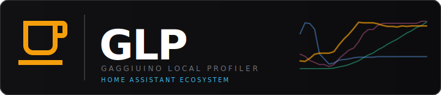

<p align="center">
  
</p>

<p align="center">
  
  
  
  
</p>

<p align="center">
  All GLP (Gaggiuino Local Profiler) components for Home Assistant — one place to find and install everything.
</p>

---

## What is GLP?

GLP turns your [Gaggiuino](https://gaggiuino.github.io/)-modded espresso machine into a fully integrated Home Assistant appliance.  
Shot history is synced automatically, every extraction is scored and visualised, and the machine's status is exposed as native HA sensors.

---

## The ecosystem at a glance

```
Gaggiuino Machine
  └─ /api/shots · /api/system/status · /api/system/info
          │
          │  sync every N min + live polling
          ▼
┌──────────────────────────────────────┐
│          GLP App  ①               │  ← Shot archive, live view, analytics,
│  Node.js · Port 8099 · HA Ingress    │    library, dial-in, maintenance,
│  /data/shots.json                    │    barista order backend
└────────────┬─────────────────────────┘
             │ REST API
    ┌─────────┴──────────┐
    ▼                    ▼
GLP Integration ②    GLP Cards ③ ④
HA sensors,          Lovelace UI
automations          in any dashboard
```

---

## Components

### ① GLP App

The core — syncs shot history, stores it locally, and serves the full web UI including shot archive, live mode, analytics, coffee library, maintenance tracker and barista order backend.

<a href="https://my.home-assistant.io/redirect/supervisor_add_addon_repository/?repository_url=https%3A%2F%2Fgithub.com%2Fmxkissnr%2Fgaggiuino-local-profiler">
  
</a>

→ [mxkissnr/gaggiuino-local-profiler](https://github.com/mxkissnr/gaggiuino-local-profiler) · [📋 Changelog](https://github.com/mxkissnr/gaggiuino-local-profiler/blob/main/gaggiuino-local-profiler/CHANGELOG.md) · [📖 Wiki](https://github.com/mxkissnr/gaggiuino-local-profiler/wiki)

---

### ② GLP HA Integration

Polls the app every 60 s and exposes all data as native HA sensors — shot count, last shot stats, score, maintenance status, preheat state and more. Required for the Lovelace cards to auto-detect configuration.

<a href="https://my.home-assistant.io/redirect/hacs_repository/?owner=mxkissnr&repository=glp-integration&category=integration">
  
</a>

→ [mxkissnr/glp-integration](https://github.com/mxkissnr/glp-integration)

---

### ③ GLP Shot Card

Lovelace card showing machine status, last shot summary, preheat progress, power button and active profile selector.

<a href="https://my.home-assistant.io/redirect/hacs_repository/?owner=mxkissnr&repository=glp-lovelace-card&category=frontend">
  
</a>

```yaml
type: custom:glp-card
# no further config needed — auto-detected from integration
```

→ [mxkissnr/glp-lovelace-card](https://github.com/mxkissnr/glp-lovelace-card)

---

### ④ GLP Order Card

Customer-facing Lovelace card for ordering espresso. Customers pick a drink from the barista-configured menu, optionally add a note, and track their order status in real time.

<a href="https://my.home-assistant.io/redirect/hacs_repository/?owner=mxkissnr&repository=glp-order-card&category=frontend">
  
</a>

```yaml
type: custom:glp-order-card
# no further config needed — auto-detected via HA ingress
```

→ [mxkissnr/glp-order-card](https://github.com/mxkissnr/glp-order-card)

---

## Full installation guide

### Step 1 — Add the GLP App

Click the button under **① GLP App** above, or manually add this repository to HA:

```
https://github.com/mxkissnr/gaggiuino-local-profiler
```

Settings → Apps → App Store → ⋮ → Repositories → paste URL → search for **Gaggiuino Local Profiler** → Install.

Configure:
```yaml
machine_host: "192.168.1.42"   # IP or hostname of your Gaggiuino controller
sync_interval: 5
switch_entity: "switch.espresso_plug"   # optional smart plug entity
```

### Step 2 — Install the GLP Integration via HACS

Click the button under **② GLP HA Integration** above. After installation go to  
**Settings → Devices & Services → Add Integration** → search **Gaggiuino Local Profiler**.

### Step 3 — Add the Lovelace cards

Click the HACS buttons under **③** and **④**. Then add to any Lovelace dashboard:

```yaml
# Shot status card
type: custom:glp-card

# Customer order card (e.g. on a tablet in the kitchen)
type: custom:glp-order-card
```

Both cards auto-detect all configuration — no manual entity IDs or URLs needed.

### Step 4 — Open the GLP web UI

Click **Open Web UI** on the app page, or navigate to the **☕ GLP** entry in your HA sidebar.

---

## Feature overview

| | Feature | Component |
|---|---|---|
| 📈 | Shot archive with pressure, flow, weight & temperature curves | App |
| 🔴 | Live mode — real-time charts during extraction | App |
| 🏆 | Shot score (0–100) — pressure, stability, duration, ratio, channeling | App |
| 📊 | Analytics — score trend, calendar heatmap, bean stats, profile performance | App |
| 📊 | P·Q Diagram — pressure vs. flow extraction signature | App |
| ⚗️ | Extraction yield % (TDS + dose) | App |
| ☕ | Coffee library — bean & grinder database with autocomplete | App |
| 📝 | Shot annotations — coffee, grinder, dose, roast date, TDS, notes, 1–5 stars | App |
| 💾 | .shot export (Decent / Visualizer.coffee) + CSV export | App |
| 🔧 | Maintenance tracker — descaling, backflush, group head, gaskets, water filter | App |
| 🔧 | Per-grinder cleaning schedule | App |
| 🔌 | Smart plug control — power machine on/off from GLP | App |
| ☕ | Preheat timer — progress bar + countdown | App |
| 🎯 | Dial-in assistant — compare a target shot with recent attempts | App |
| 📋 | Recipes — brew method, dose, yield, steps for Espresso, AeroPress, V60 and more | App |
| 📷 | Barcode / QR scanner — EAN lookup via Open Food Facts; GLP QR schema | App |
| 🔗 | kaffeebraun.com import | App |
| 📱 | PWA — installable as standalone app on Android & iOS | App |
| 🌐 | Multi-language UI — DE / EN / IT / FR / ES / NL | App |
| 🎨 | Accent color themes — Amber, Ocean, Aurora, Ember, Forest | App |
| 📋 | Order management — barista backend with queue, ETA, accept/decline | App |
| 📡 | Native HA sensors for all GLP data — usable in automations & dashboards | Integration |
| 🃏 | Machine status card — preheat progress, last shot, profile selector, power button | Shot Card |
| 🛒 | Customer order card — menu, order placement, status tracking | Order Card |

---

## Links

| | |
|---|---|
| 📖 Documentation | [Wiki](https://github.com/mxkissnr/gaggiuino-local-profiler/wiki) |
| 🐛 App issues | [gaggiuino-local-profiler/issues](https://github.com/mxkissnr/gaggiuino-local-profiler/issues) |
| 🐛 Integration issues | [glp-integration/issues](https://github.com/mxkissnr/glp-integration/issues) |
| 🐛 Shot Card issues | [glp-lovelace-card/issues](https://github.com/mxkissnr/glp-lovelace-card/issues) |
| 🐛 Order Card issues | [glp-order-card/issues](https://github.com/mxkissnr/glp-order-card/issues) |

---

## License

GPL-3.0 © 2024–2026 mxkissnr — free to use, fork and modify; any derivative work must remain open source under the same license. Commercial use is not permitted.

## Acknowledgements

Inspired by [BeanConqueror](https://github.com/graphefruit/beanconqueror) by graphefruit.  
Built on top of [Gaggiuino](https://gaggiuino.github.io/) and the original [Gaggiuino HA Integration](https://github.com/ALERTua/hass-gaggiuino) by ALERTua.

---

<p align="center">
  <sub>Built with <a href="https://claude.ai/code">Claude Code</a> by Anthropic</sub>
</p>
